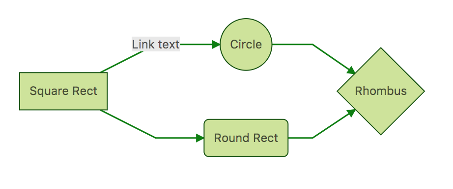

# gatsby-remark-graph

Make nice graphs in your markdown files in gatsbyjs, using [mermaid](https://mermaidjs.github.io/).

[Here](https://remark-graph-demo.netlify.com/) is a basic demo, which also uses my [starter template](https://github.com/konsumer/gatsby-starter-bootstrap-netlify/).

## install

`npm install --save gatsby-transformer-remark gatsby-remark-graph`


## How to use

```js
// In your gatsby-config.js
plugins: [
  {
    resolve: 'gatsby-transformer-remark',
    options: {
      plugins: [
        {
          resolve: 'gatsby-remark-graph',
          options: {
            // this is the language in your code-block that triggers mermaid parsing
            language: 'mermaid', // default
            theme: 'default' // could also be dark, forest, or neutral
          }
        }
      ]
    }
  }
]
```

Make sure you put it before other plugins (especially those that work with `code` blocks, like [prism](https://www.gatsbyjs.org/packages/gatsby-remark-prismjs/).)

### Usage in Markdown

    ```mermaid
    graph LR
        A[Square Rect] -- Link text --> B((Circle))
        A --> C(Round Rect)
        B --> D{Rhombus}
        C --> D
    ```

Will give you a graph that looks like this:


